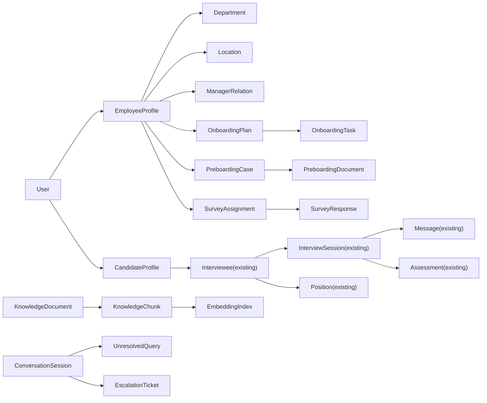

# WinLab HR Super-App Domain Model

## Design Goals

- Keep existing recruiting capabilities intact
- Introduce an employee-centric model for post-hire HR journeys
- Separate sensitive HR/PII workflows from general chat content
- Support multi-channel conversations with deterministic routing

## Core Bounded Contexts

1. Identity & Organization
2. Recruiting (existing `ai-recruiter` core)
3. Preboarding
4. Onboarding
5. Knowledge & RAG
6. HR Self-Service
7. Surveys & Feedback
8. Analytics & Reporting
9. Integrations

## High-Level Entity Map

## Reuse and Extension Mapping

| Existing Entity | Keep | Extend | New Relationship |
|---|---|---|---|
| `User` | Yes | Add identity provider fields, employee lifecycle flags | `User -> EmployeeProfile` |
| `Position` | Yes | Add org taxonomy references | Used by recruiting + onboarding templates |
| `Interviewee` | Yes | Keep as recruiting context profile | Linked to `CandidateProfile` |
| `InterviewSession` | Yes | Add channel metadata, tenant scope | Source for analytics/funnel KPIs |
| `Message` | Yes | Add moderation/classification tags | Powers unresolved/escalation detection |
| `Assessment` | Yes | Add calibration/version fields | Recruiting quality metrics |

## New Canonical Entities

### Identity & Org
- `EmployeeProfile`
- `Department`
- `Location`
- `ManagerRelation`
- `RoleAssignment` (RBAC/ABAC seed)

### Preboarding
- `PreboardingCase`
- `PreboardingForm`
- `PreboardingDocument`
- `PreboardingReviewStep`

### Onboarding
- `OnboardingPlan`
- `OnboardingMilestone`
- `OnboardingTask`
- `OnboardingEventLog`

### Knowledge / AI
- `KnowledgeDocument`
- `KnowledgeVersion`
- `KnowledgeChunk`
- `UnresolvedQuery`
- `EscalationTicket`

### Surveys
- `SurveyTemplate`
- `SurveyCampaign`
- `SurveyAssignment`
- `SurveyResponse`

### Integration & Audit
- `ExternalIdentityMap`
- `IntegrationJob`
- `IntegrationSyncCheckpoint`
- `AuditEvent`

## Data Ownership Rules

- Recruiting module owns `Interviewee`, `InterviewSession`, `Assessment`.
- HR Core owns employee identity and org entities.
- Integration module is the only write path from external systems to canonical HR entities.
- AI module reads approved KB and publishes answer metadata, but does not own transactional HR records.

## Sensitive Data Boundaries

- Preboarding documents and security forms must be stored in object storage with encrypted references in DB.
- Payroll/time balances must never be persisted in plain chat history; only short-lived response payloads and audit traces.
- Escalations require explicit user consent record before forwarding to admin queues.

