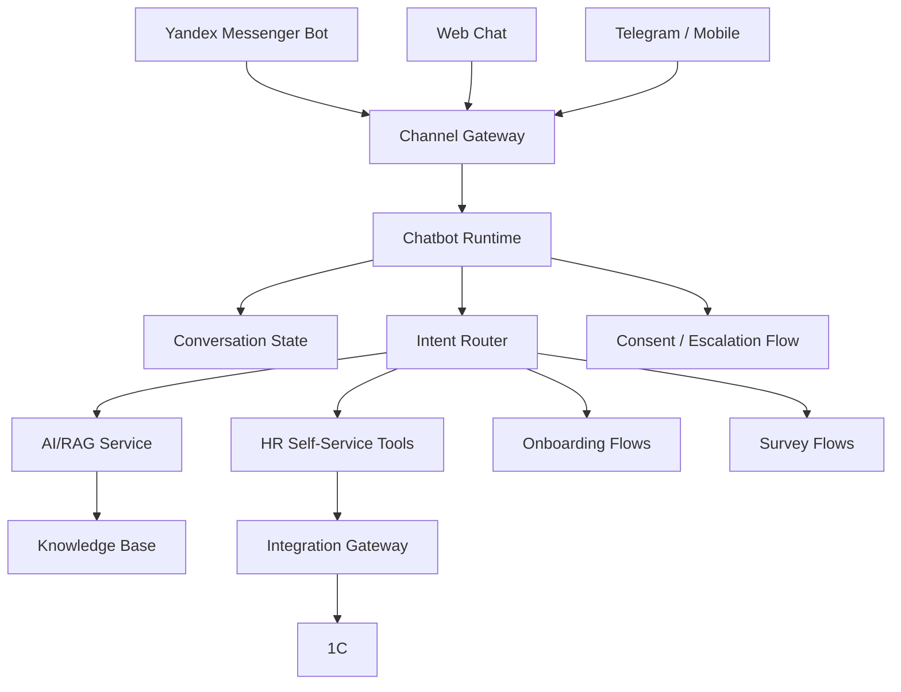
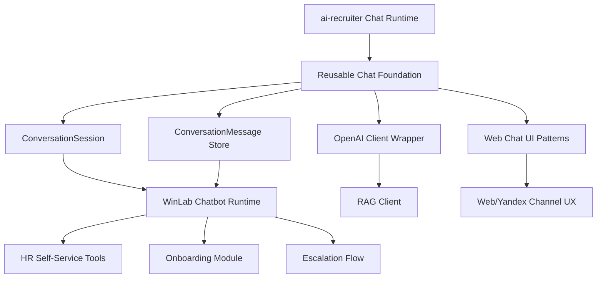
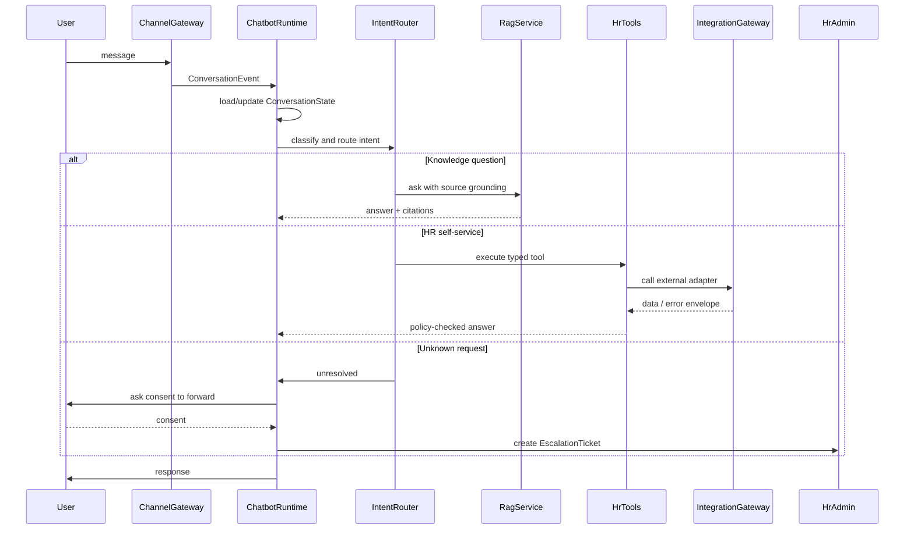

# Chatbot Runtime and Modularization

## Why Chatbot Runtime Is Explicit

`AI/RAG Service` is not the chatbot. It answers knowledge questions, creates embeddings, runs guardrails, and may call an LLM provider. The chatbot is the orchestration layer that owns conversation state, channel normalization, intent routing, consent flows, tool execution, escalation, and audit.

Without an explicit `Chatbot Runtime / Conversation Orchestrator`, the architecture can look like channels call `HR Core` or `AI/RAG` directly. That is unsafe for enterprise HR because conversational state, PII policy, unresolved intents, and channel-specific identity mapping need a dedicated runtime.

## Target Chatbot Flow



## Backend Modules

```text
server/
  modules/
    chatbot/
      channels/
        yandex.py
        web.py
        telegram.py
      conversation/
        state.py
        repository.py
      routing/
        intent_router.py
        policies.py
      tools/
        executor.py
        registry.py
      escalation/
        service.py
      audit/
        events.py
      schemas.py
      routes.py
```

### `channels`

Normalizes external channel events into internal `ConversationEvent` objects.

Responsibilities:

- receive Yandex Messenger / Web / future Telegram events;
- verify webhook signatures;
- map external users to `ExternalIdentityMap`;
- support buttons, files, deep links, and QR registration flows.

### `conversation`

Owns conversation state and persistence.

Core entities:

- `ConversationSession`;
- `ConversationMessage`;
- `ConversationState`;
- `ConversationChannelIdentity`.

### `routing`

Routes each user message to the correct domain capability.

Routing examples:

- FAQ or HR knowledge question -> `AI/RAG Service`;
- vacation, hours, payroll, certificate -> `HR Self-Service Tools`;
- onboarding progress or task -> `Onboarding Module`;
- survey answer -> `Surveys Module`;
- unknown request -> `UnresolvedQuery` + consent flow.

### `tools`

Executes strictly typed backend tools. LLMs never call external systems directly.

Examples:

- `getVacationBalance`;
- `getWorkedHours`;
- `getPayrollSummary`;
- `requestCertificate`.

Each tool must enforce RBAC/ABAC, PII scope policy, idempotency, and audit logging.

### `escalation`

Handles unresolved requests:

1. detect unresolved/low-confidence intent;
2. ask user consent to forward the question;
3. create `EscalationTicket`;
4. assign to HR/admin queue;
5. track SLA and resolution status.

### `audit`

Writes audit events for:

- PII access;
- sensitive tool execution;
- escalation consent;
- admin actions;
- knowledge source usage.

## Reusing the ai-recruiter Bot

The existing `ai-recruiter` bot/chat runtime is a strong foundation, but it should not be copied as-is into WinLab.

### Reuse Directly as Foundation

- chat hooks and web chat UX patterns;
- message/transcript persistence pattern;
- session lifecycle pattern;
- OpenAI client wrapper;
- text/voice interaction patterns;
- admin table/status/report UX patterns.

### Adapt, Do Not Reuse Directly

| ai-recruiter Concept | WinLab Adaptation |
|---|---|
| `InterviewSession` | `ConversationSession` |
| `Message` | `ConversationMessage` |
| candidate email identity | `EmployeeProfile` + `ExternalIdentityMap` |
| recruiting prompt resolver | `ConversationPromptResolver` / `BotPolicyResolver` |
| interview assessment flow | HR knowledge, onboarding, tool execution, escalation flows |

### Reuse Strategy



### Policy Separation

The runtime may be shared, but policies must be separate:

- `RecruitingBotPolicy` for interviews, vacancies, candidate assessment, and reports;
- `HrAssistantBotPolicy` for HR FAQ, onboarding, documents, 1C tools, surveys, and escalation.

## Frontend Admin Modules

```text
src/components/admin/chatbot/
  ChatbotDashboard.tsx
  UnresolvedQueriesPanel.tsx
  ConversationLogsPanel.tsx
  ChannelSettingsPanel.tsx
  BotPoliciesPanel.tsx
```

Admin capabilities:

- view unresolved questions;
- approve, assign, or close escalation tickets;
- review conversation logs and source citations;
- configure channel settings;
- manage fallback/handoff policies;
- monitor chatbot quality metrics.

## Runtime Flow



## Implementation Phases

1. Add explicit chatbot architecture to diagrams and documentation.
2. Extract common chat foundation from `ai-recruiter` without changing recruiting behavior.
3. Create WinLab `ConversationSession` and `ConversationMessage` models.
4. Add `IntentRouter` with RAG, HR tools, onboarding, surveys, and unresolved routes.
5. Add Yandex channel adapter.
6. Add Chatbot Admin panels for unresolved queries, logs, channels, and policies.

