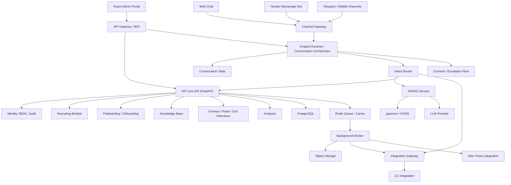

# Архитектура HR Super-App ВинЛаб

## Исходные требования и контекст

Архитектура построена на базе требований WinLab (адаптация, база знаний, кадровые self-service запросы, опросы, пребординг, аналитика, интеграции) и текущих возможностей `ai-recruiter` в `bkp`.

Ключевое решение: не переписывать систему с нуля, а эволюционно расширять существующий продукт как доменный модуль `Recruiting` внутри HR-платформы.

## Архитектурный принцип

Базовый подход:

- модульный монолит для бизнес-доменов;
- отдельные технические сервисы для AI/RAG и фоновой обработки;
- отдельный интеграционный слой для внешних систем (1C, мессенджеры, будущие контуры).

## Доменные модули

1. `Identity/Organization/Security`  
   `Tenant`, `Department`, `Location`, `EmployeeProfile`, `ManagerRelation`, RBAC/ABAC, audit, consent flow.

2. `Recruiting` (reuse из текущего продукта)  
   `Position`, `Interviewee`, `InviteLink`, `InterviewSession`, `Message`, `Assessment`, `Report`.

3. `Preboarding`  
   анкета СБ, документы для трудоустройства, статусный workflow, безопасное хранение.

4. `Onboarding/Adaptation`  
   планы 1 день/1 неделя/1 месяц, чек-листы, контрольные точки, прогресс по орг-срезам.

5. `Knowledge Base + RAG`  
   управляемый контент, верифицированные источники, цитирование, unresolved intents.

6. `HR Self-Service`  
   кадровые запросы через backend tools к 1C (без прямого доступа LLM к 1C).

7. `Surveys/Feedback/Exit`  
   pulse и exit-опросы, аналитика и экспорт.

8. `Analytics`  
   адаптация, self-service, recruiting, surveys KPI; дальнейший переход к BI/data mart.

9. `Chatbot Runtime / Conversation Orchestrator`  
   отдельный orchestration layer для каналов, состояния диалога, intent routing, RAG-вызовов, HR tools, consent/escalation и audit. Это не UI и не LLM: он связывает каналы (`Yandex`, `Web`, будущий `Telegram/mobile`) с HR-доменами и AI/RAG.

## Интеграции

### 1C
- интеграционный gateway;
- справочники + whitelist API запросов;
- retry, circuit breaker, кэш, мониторинг.

### Яндекс Мессенджер
- channel adapter по интерфейсу `BotChannel`;
- унифицированное отображение `external_user_id` в внутреннюю идентичность.

### Сбер Пульс
- закладывается контракт и event model, реализация по мере обязательности.

## Данные и хранилища

- PostgreSQL (OLTP)
- pgvector (или FAISS на прототипе)
- Redis (cache/queue/rate-limit)
- Object Storage (документы, вложения, отчеты)
- Alembic как единственный механизм миграций

## AI-архитектура

- RAG для KB
- function/tool-calling для кадровых операций
- versioned prompts
- guardrails (PII, source grounding, escalation policy)
- quality telemetry (confidence, unresolved, feedback)

## Применение к текущему ai-recruiter

- разнести `server/routes` и `server/services` по доменным пакетам;
- разгрузить `server/server.py` на отдельные routers/services;
- разделить тяжелый admin UI на модульные панели;
- оставить текущий JWT/RBAC в MVP, подготовить траекторию на enterprise identity/SSO.
- использовать существующий chat/runtime foundation из `ai-recruiter` как основу для `Chatbot Runtime`, но отделить HR chatbot policies от recruiting interview policies.

## Реализационные артефакты

Детализация выполнена в документах:

- `docs/hr-super-app/01-requirements-matrix.md`
- `docs/hr-super-app/02-domain-model.md`
- `docs/hr-super-app/03-modularization-blueprint.md`
- `docs/hr-super-app/04-integration-contracts.md`
- `docs/hr-super-app/05-mvp-roadmap.md`
- `docs/hr-super-app/06-chatbot-runtime-modularization.md`

